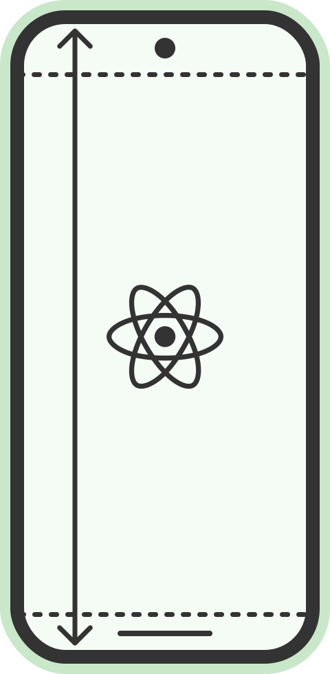

# react-native-edge-to-edge

Effortlessly enable [edge-to-edge](https://developer.android.com/develop/ui/views/layout/edge-to-edge) display in React Native, allowing your Android (v6 and above) app content to flow seamlessly beneath the system bars.

[](https://github.com/zoontek/react-native-edge-to-edge/blob/main/LICENSE)
[](https://www.npmjs.org/package/react-native-edge-to-edge)
[](https://www.npmjs.org/package/react-native-edge-to-edge)



## Credits

This project has been built and is maintained thanks to the support from [Expo](https://expo.dev).

<a href="https://expo.io">
  
</a>

## Support

This library follows the React Native [releases support policy](https://github.com/reactwg/react-native-releases/blob/main/docs/support.md).<br>
It is supporting the **latest version**, and the **two previous minor series**.

## Motivations

### Android 15

Recently, Google introduced a significant change: apps targeting SDK 35 will have edge-to-edge display [enforced by default](https://developer.android.com/about/versions/15/behavior-changes-15#edge-to-edge) on Android 15+. Google is _likely_ to mandate that app updates on the Play Store target SDK 35 starting on August 31, 2025. This assumption is based on the [previous years' requirements following a similar timeline](https://support.google.com/googleplay/android-developer/answer/11926878?sjid=11853000253346477363-EU#zippy=%2Care-there-any-exceptions-for-existing-apps-targeting-api-or-below:~:text=App%20update%20requirements).

### Consistency

iOS has long used edge-to-edge displays, so adopting this design across all platforms ensures a consistent user experience. It also simplifies managing safe areas, eliminating the need for special cases specific to Android.

### Immersive mode

[Immersive mode](https://developer.android.com/develop/ui/views/layout/immersive) allows you to hide the status and navigation bars, making it ideal for full-screen experiences. Currently, the built-in [`StatusBar`](https://reactnative.dev/docs/statusbar) component uses [`FLAG_FULLSCREEN`](https://developer.android.com/reference/android/view/WindowManager.LayoutParams#FLAG_FULLSCREEN), a flag that has been deprecated since Android 11.

## Installation

```bash
$ npm i -S react-native-edge-to-edge
# --- or ---
$ yarn add react-native-edge-to-edge
```

### Pick a parent theme

This library requires you to update the parent of your Android `AppTheme` to an edge-to-edge version. Don't worry, it's very easy to understand! You just need to choose a theme based on the current value:

| If you currently have…                               | …you should use                            |
| :--------------------------------------------------- | :----------------------------------------- |
| `Theme.AppCompat.DayNight.NoActionBar`               | `Theme.EdgeToEdge`                         |
| `Theme.MaterialComponents.DayNight.NoActionBar`      | `Theme.EdgeToEdge.Material2`               |
| `Theme.Material3.DayNight.NoActionBar`               | `Theme.EdgeToEdge.Material3`               |
| `Theme.Material3.DynamicColors.DayNight.NoActionBar` | `Theme.EdgeToEdge.Material3.Dynamic`       |
| `Theme.AppCompat.Light.NoActionBar`                  | `Theme.EdgeToEdge.Light`                   |
| `Theme.MaterialComponents.Light.NoActionBar`         | `Theme.EdgeToEdge.Material2.Light`         |
| `Theme.Material3.Light.NoActionBar`                  | `Theme.EdgeToEdge.Material3.Light`         |
| `Theme.Material3.DynamicColors.Light.NoActionBar`    | `Theme.EdgeToEdge.Material3.Dynamic.Light` |

### Expo

Add the library plugin in your `app.json` config file and [create a new build](https://docs.expo.dev/develop/development-builds/create-a-build) 👷:

```json
{
  "expo": {
    "plugins": [
      [
        "react-native-edge-to-edge",
        {
          "android": {
            "parentTheme": "Light",
            "enforceNavigationBarContrast": false
          }
        }
      ]
    ]
  }
}
```

_📌 The available plugins options are:_

```ts
type ParentTheme =
  | "Default" // uses `Theme.EdgeToEdge`
  | "Material2" // uses `Theme.EdgeToEdge.Material2`
  | "Material3" // uses `Theme.EdgeToEdge.Material3`
  | "Material3.Dynamic" // uses `Theme.EdgeToEdge.Material3.Dynamic`
  | "Light" // uses `Theme.EdgeToEdge.Light`
  | "Material2.Light" // uses `Theme.EdgeToEdge.Material2.Light`
  | "Material3.Light" // uses `Theme.EdgeToEdge.Material3.Light`
  | "Material3.Dynamic.Light"; // uses `Theme.EdgeToEdge.Material3.Dynamic.Light`

type Options = {
  android?: {
    // see the "Pick a parent theme" section
    parentTheme?: ParentTheme; // optional (default: `Default`)
    // see the "Transparent navigation bar" section
    enforceNavigationBarContrast?: boolean; // optional (default: `true`)
  };
};
```

> [!NOTE]
> This library is not yet supported in the [Expo Go](https://expo.dev/go) sandbox app.

### Bare React Native

Edit your `android/app/src/main/res/values/styles.xml` file to inherit from one of the provided themes:

```xml
<resources>
  <!-- update your AppTheme parent (see the "Pick a parent theme" section) -->
  <style name="AppTheme" parent="Theme.EdgeToEdge">
    <!-- … -->
    <!-- disable the contrasting background of the navigation bar (optional) -->
    <item name="enforceNavigationBarContrast">false</item>
  </style>
</resources>
```

## Considerations

### Transparent navigation bar

By default, this library adopts [Android 15 defaults](https://developer.android.com/about/versions/15/behavior-changes-15#ux): a fully transparent status bar, a fully transparent gesture navigation bar, and a semi-opaque button navigation bar. To enforce full transparency in all cases, set the `enforceNavigationBarContrast` option to `false`.<br/>
Note that by doing so, you will need to manage the navigation bar style (using `SystemBars`) in the same way you handle the status bar.

### Keyboard management

Enabling edge-to-edge display disrupts Android keyboard management (`android:windowSoftInputMode="adjustResize"`), requiring an alternative solution. While [`KeyboardAvoidingView`](https://reactnative.dev/docs/keyboardavoidingview) is a viable option, we recommend using [react-native-keyboard-controller](https://github.com/kirillzyusko/react-native-keyboard-controller) for its enhanced capabilities.

### Safe area management

Effective safe area management is essential to prevent content from being displayed behind transparent system bars. To achieve this, we highly recommend using [`react-native-safe-area-context`](https://github.com/th3rdwave/react-native-safe-area-context), a well-known and trusted library.

### Modal component quirks

React native built-in [`Modal`](https://reactnative.dev/docs/modal) component runs in its own native context, so be sure to set both the `statusBarTranslucent` and `navigationBarTranslucent` props to `true`. However, we recommend using the [react-navigation modals](https://reactnavigation.org/docs/modal) or the [`expo-router` modal screens](https://docs.expo.dev/router/advanced/modals/#modal-screen-using-expo-router) instead.

## API

### SystemBars

Using [`StatusBar`](https://reactnative.dev/docs/statusbar), [`expo-status-bar`](https://docs.expo.dev/versions/latest/sdk/status-bar), or [`expo-navigation-bar`](https://docs.expo.dev/versions/latest/sdk/navigation-bar/) in apps with edge-to-edge layout enabled may cause unexpected behavior, as they currently use [deprecated APIs](https://developer.android.com/about/versions/15/behavior-changes-15#deprecated-apis).<br/>
To address this, we provide a component to replace them and manage your app's system bars: `<SystemBars />`.

```tsx
import { SystemBars } from "react-native-edge-to-edge";

// "auto" is based on current color scheme (light -> dark content, dark -> light content)
type Style = "auto" | "inverted" | "light" | "dark";

type SystemBarsProps = {
  // set the color of the system bar content (as no effect on semi-opaque navigation bar)
  style?: Style | { statusBar?: Style; navigationBar?: Style };
  // hide system bars (the navigation bar cannot be hidden on iOS)
  hidden?: boolean | { statusBar?: boolean; navigationBar?: boolean };
};

const App = () => (
  <>
    <SystemBars style="light" />
    {/* … */}
  </>
);
```

#### SystemBars.pushStackEntry

```ts
const entry: SystemBarsEntry = SystemBars.pushStackEntry(
  props /*: SystemBarsProps */,
);
```

#### SystemBars.popStackEntry

```ts
SystemBars.popStackEntry(entry /*: SystemBarsEntry */);
```

#### SystemBars.replaceStackEntry

```ts
const entry: SystemBarsEntry = SystemBars.replaceStackEntry(
  entry /*: SystemBarsEntry */,
  props /*: SystemBarsProps */,
);
```

#### SystemBars.setStyle

```ts
SystemBars.setStyle(style /*: SystemBarsProps["style"] */);
```

#### SystemBars.setHidden

```ts
SystemBars.setHidden(style /*: SystemBarsProps["hidden"] */);
```

## Third-party libraries 🧩

If you're an author and your package interferes with edge-to-edge, refer to the [`react-native-is-edge-to-edge` `README.md`](./react-native-is-edge-to-edge) for compatibility instructions.

## Troubleshooting 🤔

#### The system bars stays opaque

Until third-party libraries officially add support for `react-native-edge-to-edge` to set these options automatically, you may need to adjust them manually to prevent interference with the library.

For example, make sure to set `react-native-reanimated` `useAnimatedKeyboard` `isStatusBarTranslucentAndroid` and `isNavigationBarTranslucentAndroid` to `true` (until [this PR](https://github.com/software-mansion/react-native-reanimated/pull/6732) is merged), or to replace all occurrences of the built-in `StatusBar`, [`expo-status-bar`](https://docs.expo.dev/versions/latest/sdk/status-bar) and [`expo-navigation-bar`](https://docs.expo.dev/versions/latest/sdk/navigation-bar/) with `SystemBars`.

#### The navigation bar style is erratic

There's currently [an open issue](https://issuetracker.google.com/issues/346386744) with the Android 15 emulator image regarding the navigation bar style when it is is fully transparent. This issue does not occur on physical devices.
